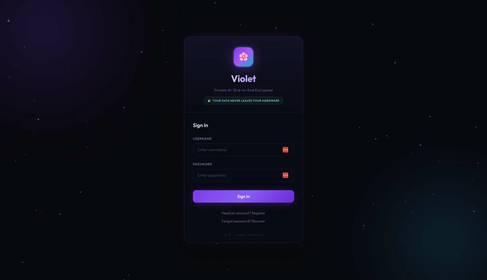
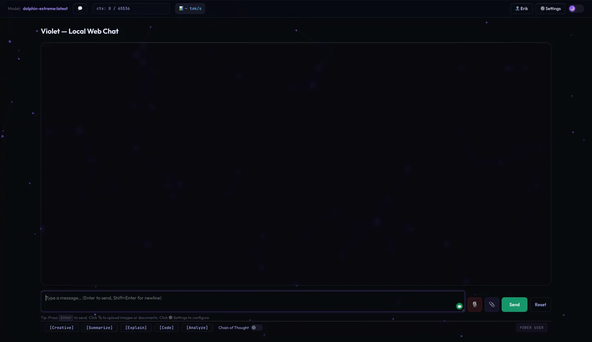
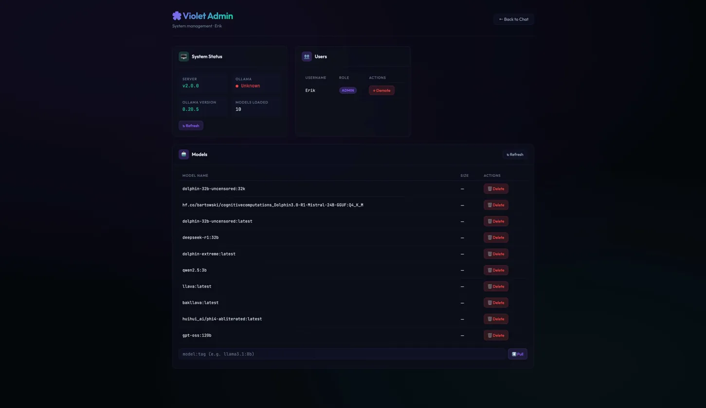

# Project Violet 🌸

**Private AI · End-to-End Encrypted · Your data never leaves your hardware.**

Violet is a self-hosted web chat interface built around local LLM inference. I built it because I wanted a capable AI assistant that didn't send my data to a third party -- everything runs on my own hardware, served through a secure Cloudflare tunnel.

---

## What it does

- Streaming chat interface with multiple prompt modes (Creative, Summarize, Explain, Code, Analyze)
- Local LLM inference via llama.cpp with full CUDA acceleration
- Multi-model support -- currently running ten models including Dolphin, DeepSeek, Qwen, and multimodal options
- File and image upload support
- Conversation history
- Chain of thought mode
- Full admin panel for model management and user control
- User authentication with role-based access (Admin / Power User)
- Accessible from anywhere via Cloudflare tunnel

---

## Screenshots

### Chat Interface

### Admin Panel

---

## Stack

| Layer | Technology |
|---|---|
| Backend | Flask |
| Inference | llama.cpp (CUDA accelerated) |
| Database | SQLite |
| Hardware | NVIDIA DGX Spark |
| Networking | Cloudflare Tunnel |

---

## Notes

This is a personal project built for my own use and is not open for public deployment or contributions. The source code is kept private. This repo exists as a portfolio showcase.

*I used AI tools heavily to accelerate the build -- because knowing how to leverage AI effectively to ship working software is the whole point.*
